## 相关软件的安装 ##
### jdk 安装 ###
进入java官网下载界面 
http://www.oracle.com/technetwork/java/javase/downloads/index.html
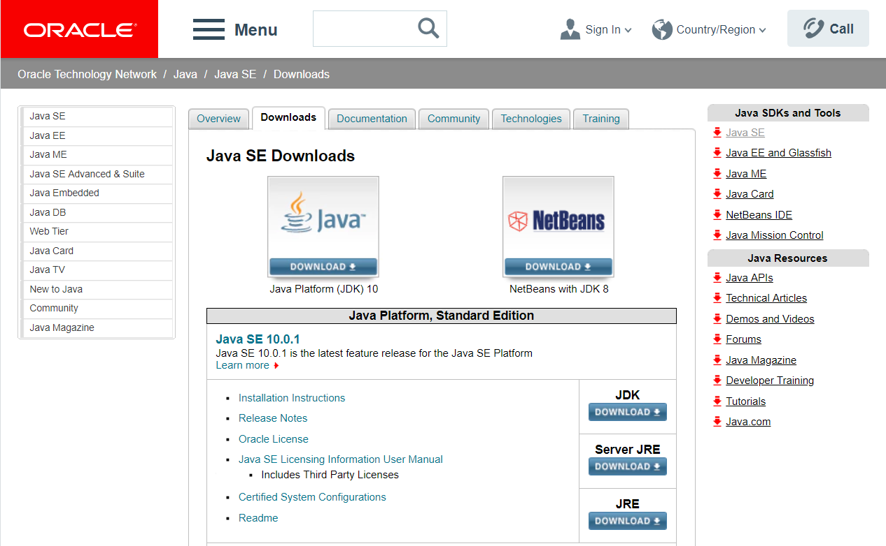

这里选择的是jdk1.8版本

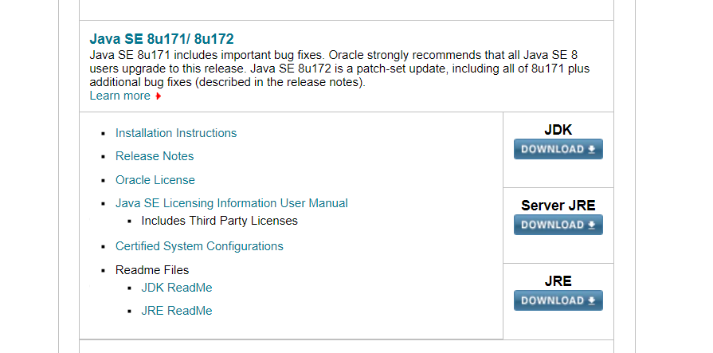

同意协议后即可下载

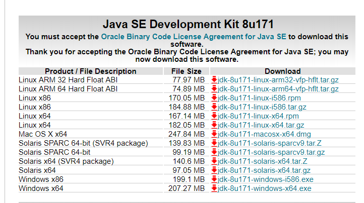

打开安装包即可安装完成

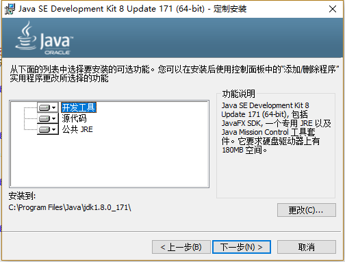

### Tomcat 安装 ###
进入tomcat官网页面 http://tomcat.apache.org/ 下载tomcat9

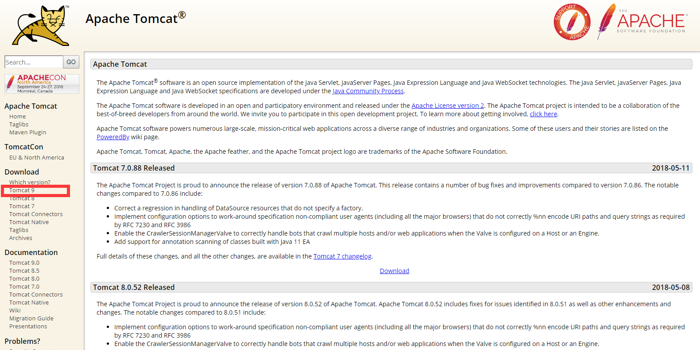

选择格式下载

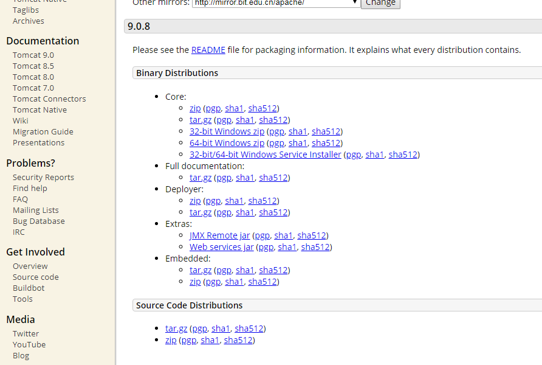

这里以安装版的作为例子

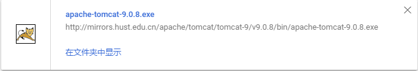

进入安装界面

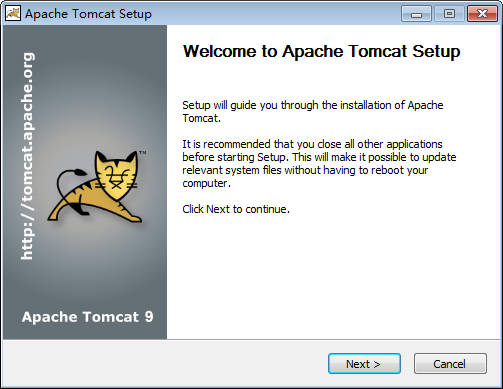

安装内容默认

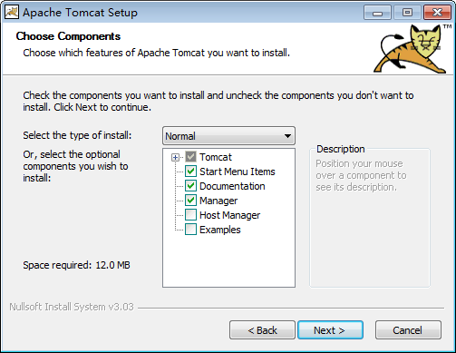

端口配置默认 填写用户名和密码

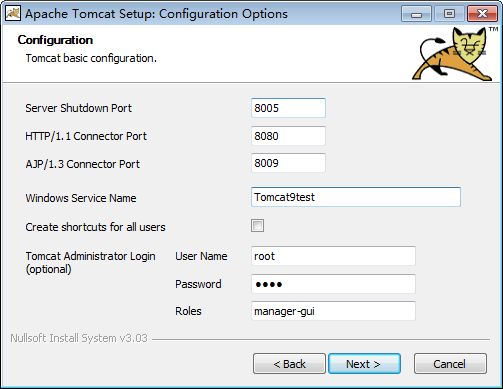

选择配置的jdk版本，本次实验使用jdk1.8版本

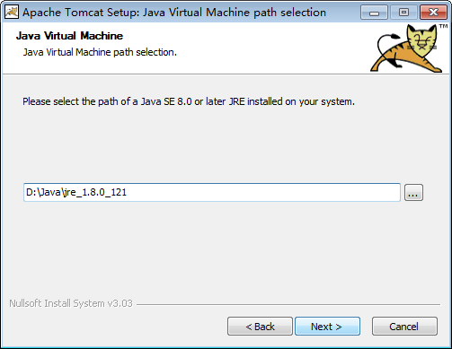

选择安装目录

安装完成

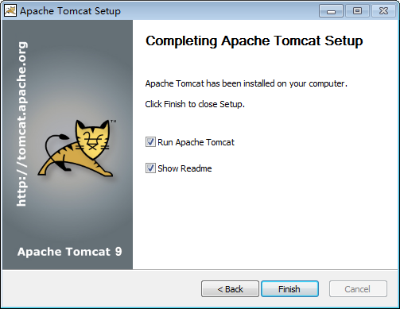

### NetBeans 安装 ###

进入安装界面

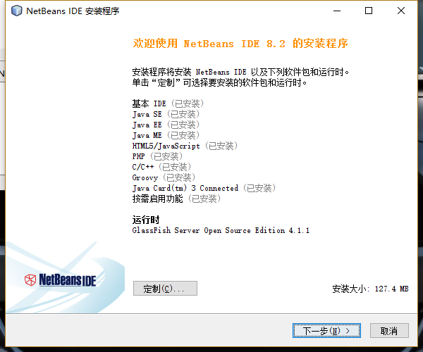

选择安装目录

点击安装确定

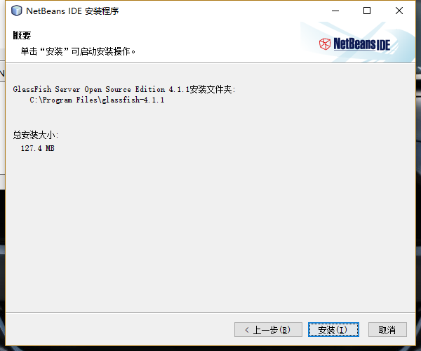

由于本机已经安装过 故具体安装过程不详细展开

## 第一个java web程序 ##

打开netbeans主界面 选择创建新项目 选择创建java web应用程序

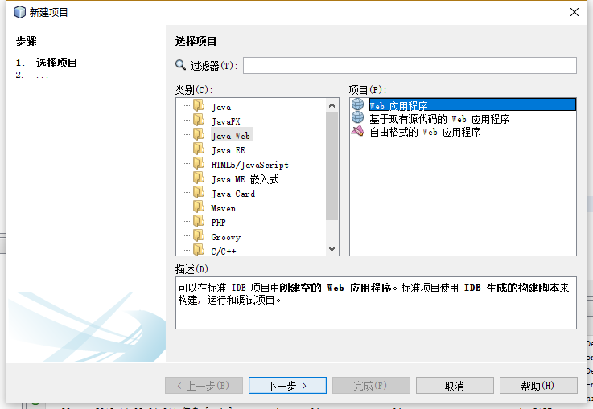

填写项目名称 确定项目目录

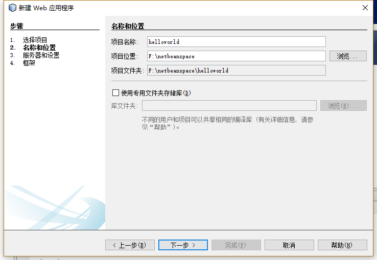

选择服务器 这里使用tomcat

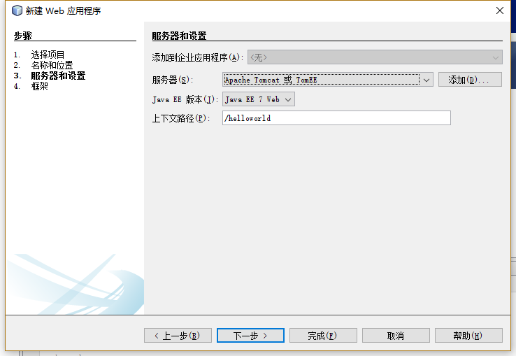

选择框架 由于是做第一个最简单的Java web程序 所以暂不勾选任何框架

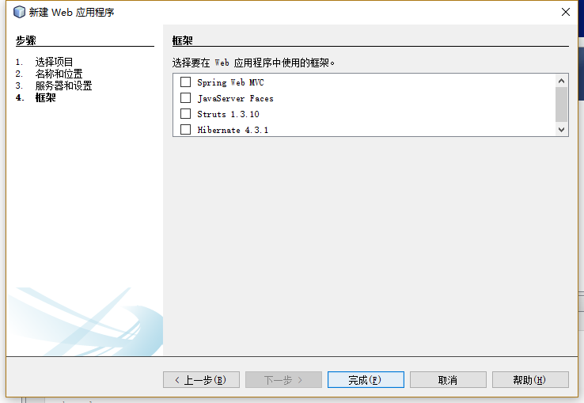

生成的项目的结构如下

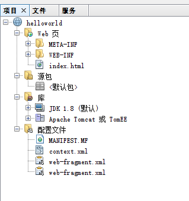

修改index.html里面的内容

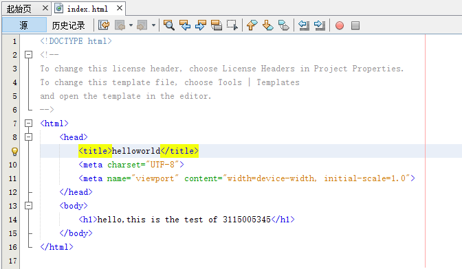

右键项目点击运行按钮 实例效果如下

