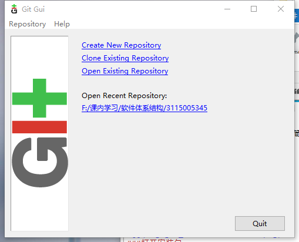
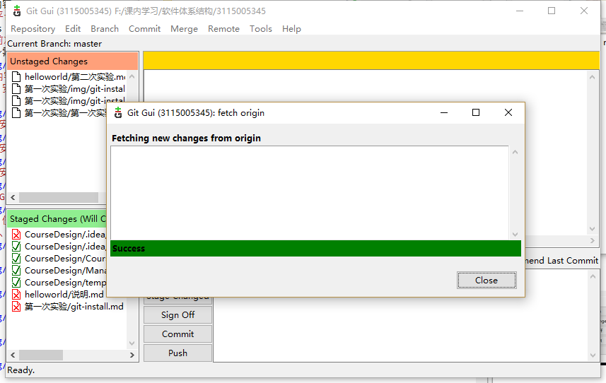
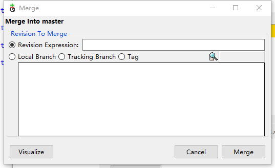
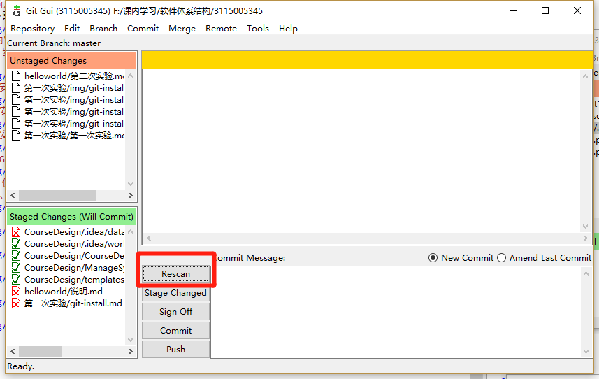
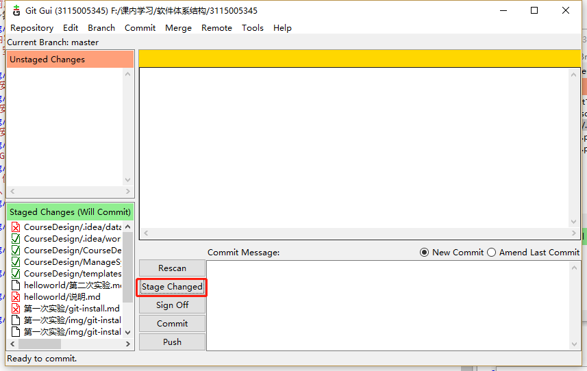
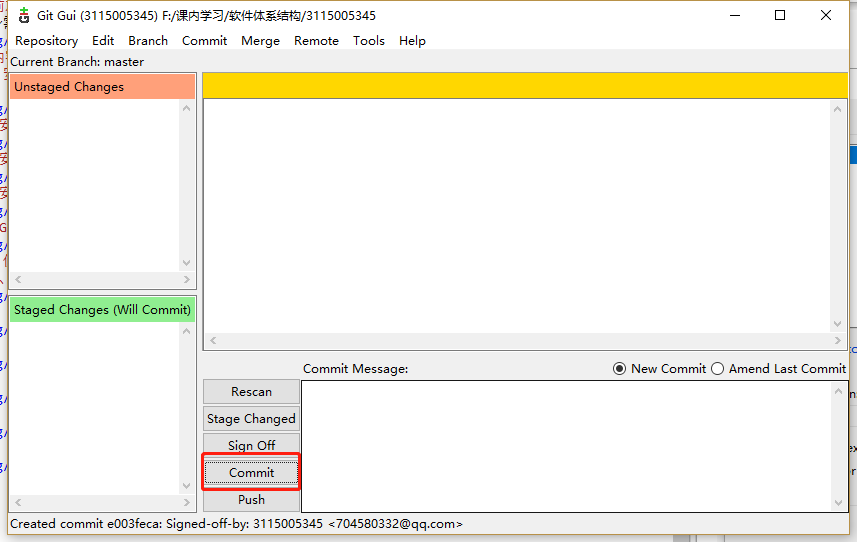
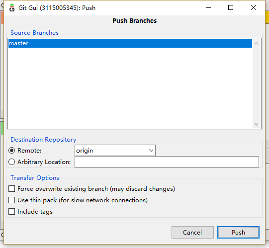

# 实验目的
学会Git的使用 内容包括 Git 软件的安装和简单使用，比如 增加文件，提交，创建分支，增加远程，下拉、上推，合并等内容。
# 实验平台
Windows 10
# 实验前准备
根据自身需要选择安装Git的版本

# 实验内容
## Git 安装
###  下载
######下载git

######进入下载页面

######默认设置一直点“下一步”即可

###
###运行Git

##Git 使用
######创建、克隆或打开

######下拉

######合并

######扫描

######缓冲

######提交

######上推

